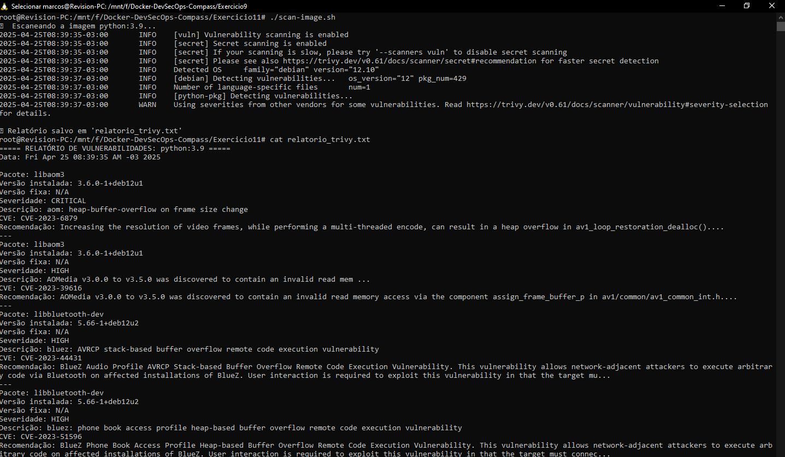
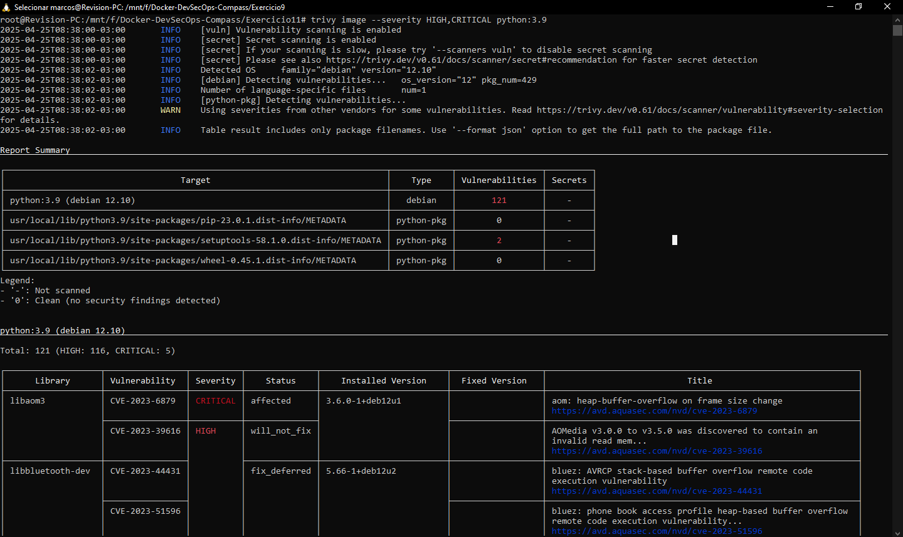

# Analisar imagem Docker com Trivy
Trivy é uma ferramenta open source para análise de vulnerabilidades em imagens
Docker. Neste exercício, você irá analisar uma imagem pública, como python:3.9 ou
node:16, em busca de vulnerabilidades conhecidas.

## 1. Intalação do Trivy
Adiciona repositório oficial
```bash
sudo apt install wget apt-transport-https gnupg lsb-release -y
wget -qO - https://aquasecurity.github.io/trivy-repo/deb/public.key | \
  gpg --dearmor | sudo tee /usr/share/keyrings/trivy.gpg > /dev/null

echo "deb [signed-by=/usr/share/keyrings/trivy.gpg] https://aquasecurity.github.io/trivy-repo/deb generic main" | \
  sudo tee /etc/apt/sources.list.d/trivy.list
```
Em seguida instale o trivy
```bash
sudo apt update && apt upgrade -y
sudo apt install trivy -y
trivy --version
```
O último comando serve para verificar a instalação do trivy, espera-se uma resposta paracida com essa:
```bash
Version: 0.61.1 
```

## 2. Instalação jq
O jq é uma ferramenta de linha de comando para processar arquivos JSON, facilitando a visualização e manipulação dos dados. Instale com apenas um comando.
```bash
sudo apt install jq -y
```

## 3. Rodando o comando
Copie o arquivo "scan-image.sh" para sua máquina, dentro deste script tem uma variável IMAGE, coloque ali o nome de uma imagem válida para ser analisada. Dê permissões de execução para o script, depois o execute.
```bash
sudo chmod +x scan-image.sh
./scan-image.sh
```
</img>

Se prefirir pode rodar apenas o comando direto no terminal, assim terá a saída padrão, sem gravar em um arquivo.
```bash
trivy image --severity HIGH,CRITICAL python:3.9
```
</img>