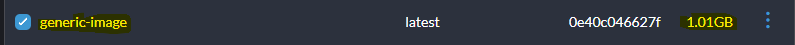
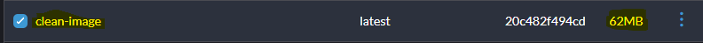
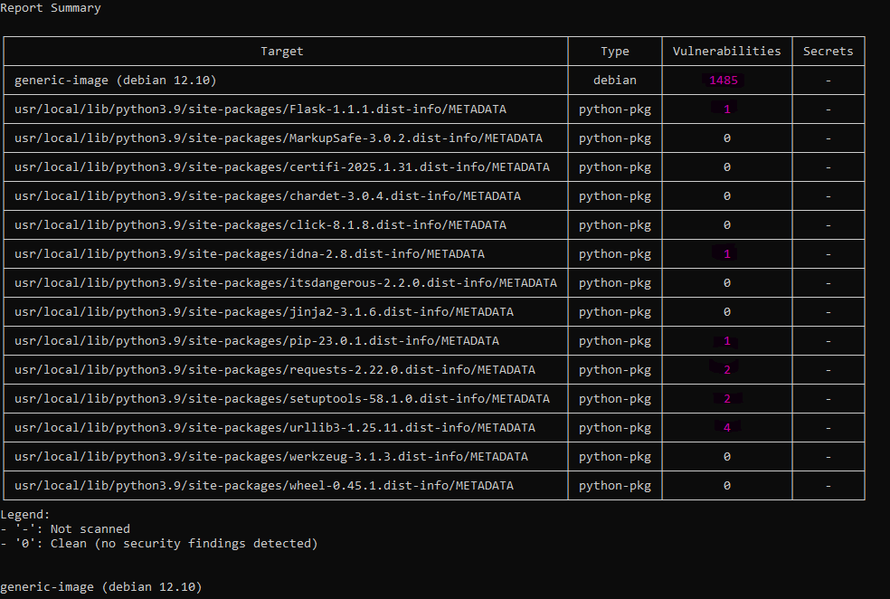
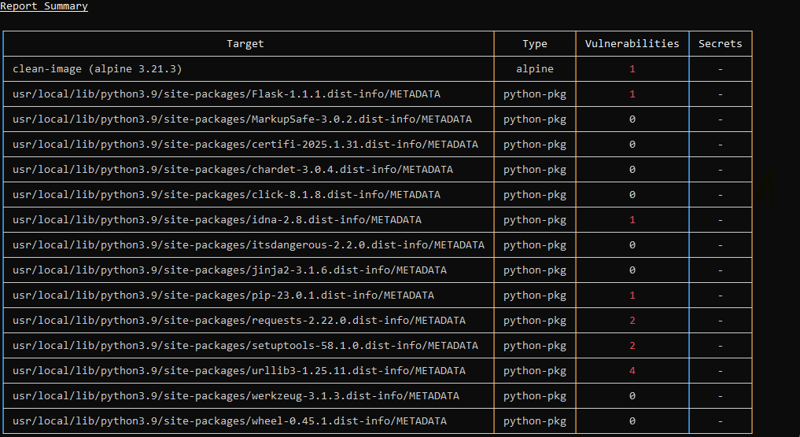
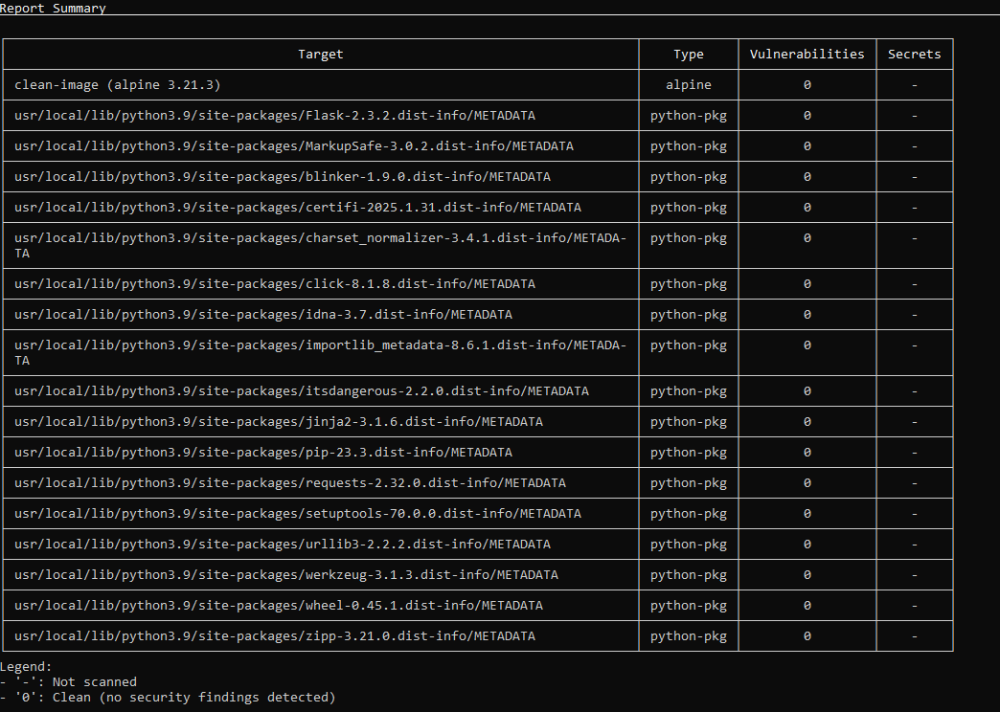

# Corrigir vulnerabilidades encontradas
Após identificar vulnerabilidades com ferramentas como o Trivy, o próximo passo é
corrigi-las. Imagens grandes e genéricas frequentemente trazem bibliotecas
desnecessárias e vulneráveis, além de usarem o usuário root por padrão. Neste
exercício, você irá trabalhar com um exemplo de Dockerfile com más práticas e
aplicar melhorias para construir uma imagem mais segura e enxuta. Identifique as
melhorias e gere uma nova versão de Dockerfile

## 1. Identificação de falhas/melhorias
### 1.1 Imagem genérica
- Falha: Imagens base como python:3.9 são grandes e incluem bibliotecas e dependências que nem sempre são necessárias para a aplicação. 
- Melhoria: Usar uma imagem mais enxuta e específica, como por exemplo o Alpine. Ele é uma distribuição enxuta que reduz o tamanho da imagem e elimina pacotes e dependências desnecessárias.

### 1.2 Não root
- Falha: Quando você executa um container com o usuário root, ele tem permissões elevadas dentro do container, o que pode ser um risco de segurança.
- Melhoria: Criar um usuário não-root para executar a aplicação dentro do container. Isso limita os privilégios e reduz os danos em caso de comprometimento.

### 1.3 Gerenciar arquivos
- Falha: Usar o COPY . . pode copiar arquivos desnecessários, como arquivos de configuração e logs. Copiar tudo de uma vez pode aumentar o tamanho da imagem e expor mais arquivos do que o necessário.
- Melhoria: Copiar apenas os arquivos necessários. Crie um diretório de trabalho (WORKDIR) e copie apenas o que for essencial para a execução da aplicação.

## 2. Arquivo Dockerfile
```dockerfile
FROM python:3.9-alpine

RUN adduser -D appuser

WORKDIR /app

COPY requirements.txt /app/

RUN pip install --no-cache-dir -r requirements.txt

COPY app.py /app/

USER appuser

EXPOSE 5000

CMD ["python", "app.py"]
```

## 3. Arquivo requirements
Alterações feitas no arquivo de instalação de dependências para eliminar vulnerabilidades.
```plaintext
flask==2.3.2
requests==2.32.0
idna==3.7
pip==23.3
setuptools==70.0.0
urllib3==2.2.2
```

## 4. Comparação
Criando um Dockerfile com a seguinte configuração e comparando com a criada utilizando boas práticas.
```Dockerfile
FROM python:3.9
COPY . .
RUN pip install -r requirements.txt
EXPOSE 5000
CMD ["python", "app.py"]
```
É passado como *requirements* apenas "flask==1.1.1" e "requests==2.22.0", no entanto na instalação limpa modifiquei o arquivo *requirements* e adicionei uma linha de comando no Dockerfile, para eliminar uma vulnerabilidade que o requirements não conseguia eliminar.
```Dockerfile
RUN apk update && apk add --no-cache sqlite-libs=3.48.0-r1
```

Inicialmente já se vê uma enorme diferença no tamanho da imagem criada, sendo a primeira utilizando python:3.9 e a segunda utilizando python:3.9-alpine.
</img>
</img>

### 4.1 Vulnerabilidades encontradas (trivy)
- Instalaçao com imagem genérica
</img>

- Instalação com imagem reduzida
</img>

- Instalação com imagem reduzida e alteração do requirements
</img>

## 5. Conclusão
A correção de vulnerabilidades em imagens Docker é essencial para garantir segurança e eficiência. Neste exercício, demonstramos que imagens genéricas como python:3.9 são maiores, contêm dependências desnecessárias e apresentam mais falhas de segurança.
Com a adoção de boas práticas — como o uso de imagens enxutas (python:3.9-alpine), execução com usuário não-root, cópia seletiva de arquivos e atualização das dependências no requirements.txt — foi possível reduzir significativamente o tamanho da imagem e o número de vulnerabilidades.
Essas melhorias tornam o ambiente mais seguro, leve e pronto para produção.