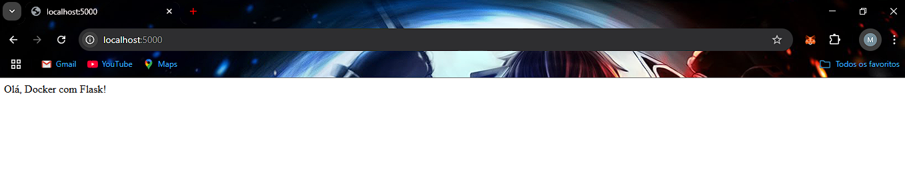

# Criando um Dockerfile para uma aplicação simples em Python
Crie um Dockerfile para uma aplicação Flask que retorna uma mensagem ao acessar
um endpoint, para isso utilize o projeto Docker Flask

## 1.  Criar a aplicação Flask
```python
from flask import Flask

app = Flask(__name__)

@app.route('/')
def hello():
    return "Olá, Docker com Flask"

if __name__ == '__main__':
    app.run(host='0.0.0.0', port=5000)
```

## 2. Criar o arquivo requirements.txt
Para garantir que as dependências da aplicação sejam instaladas corretamente no container, crie um arquivo requirements.txt

flask

## 3. Crie o Dockerfile
Para remover um container específico, primeiro pare o container. Em seguida, use o comando docker rm seguido pelo ID ou nome do container
```dockerfile
FROM python:3.9-slim
WORKDIR /app
COPY requirements.txt /app/
RUN pip install --no-cache-dir -r requirements.txt
COPY . /app/
EXPOSE 5000
CMD ["python", "app.py"]
```

## 4. Construa a imagem e rode o container
```bash
docker build -t flask-docker-app .
docker run -p 5000:5000 flask-docker-app
```

## 5. Verificação
Abra o navegador e acesse http://localhost:5000 para testar a aplicação.

</img>