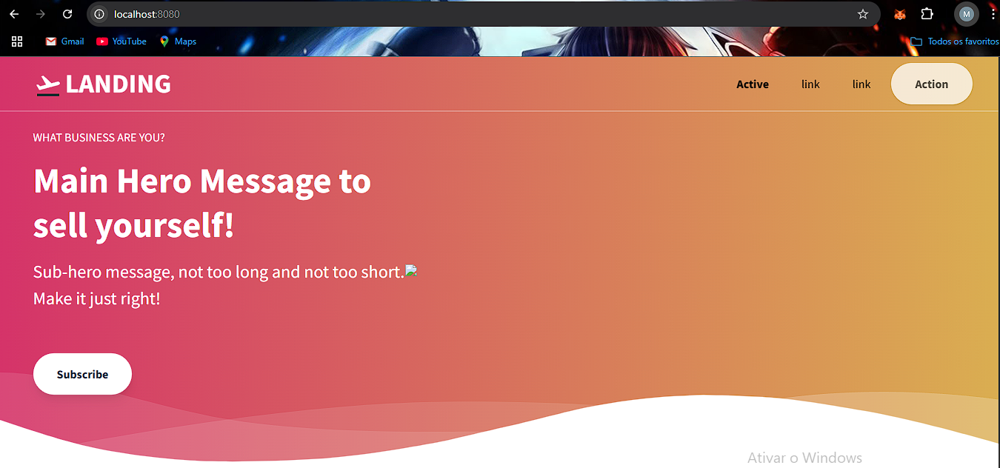

# Rodando um container básico
Execute um container usando a imagem do Nginx e acesse a página padrão no
navegador. Use a landing page do TailwindCSS como site estático dentro do
container

## 1. Criando o arquivo index.html
Crie ou clone um arquivo html, no caso estou utilizando o seguinte arquivo [TailwindCSS](https://github.com/tailwindtoolbox/Landing-Page/blob/master/index.html)

## 2. Crie o Dockerfile
```Dockerfile
FROM nginx:latest
COPY index.html /usr/share/nginx/html/index.html
```

## 3. Construa a imagem
No terminal digite o seguinte comando
```bash
docker build -t nginx-tailwind .
```

## 4. Rode o container
```bash
docker run -d -p 8080:80 --name site-nginx nginx-tailwind
```

## 5. Verificação
Abra o navegador e acesse http://localhost:8080. A landing page do TailwindCSS deve ser exibida.

</img>