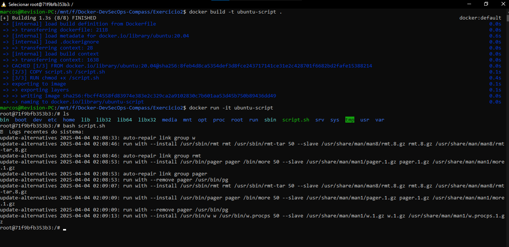

# Criando e rodando um container interativo
Inicie um container Ubuntu e interaja com o terminal dele. Teste um script Bash que
imprime logs do sistema ou instala pacotes de forma interativa.

## 1. Criando o script
Crie um script básico, como por exemplo imprimir logs do sistema.
```bash
#!/bin/bash

echo "📄 Logs recentes do sistema:"
tail -n 10 /var/log/alternatives.log 
```

## 2. Crie o Dockerfile
```Dockerfile
FROM ubuntu:20.04
COPY script.sh /script.sh
RUN chmod +x /script.sh
```

## 3. Construa a imagem
No terminal digite o seguinte comando
```bash
docker build -t ubuntu-script .
```

## 4. Rode o container de forma interativa
```bash
docker run -it ubuntu-script
```

## 5. Rode o script
```bash
bash /script.sh
```
</img>
