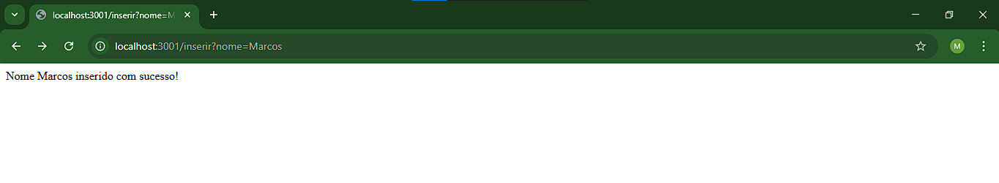
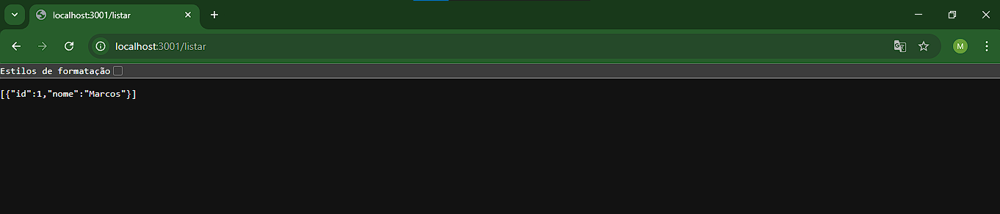
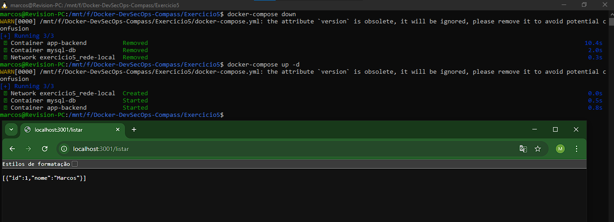

# Criando e utilizando volumes para persistência de dados
Execute um container MySQL e configure um volume para armazenar os dados do
banco de forma persistente. Para aplicar esse conceito você pode utilizar o reactexpress-mysql

## 1.  Criar um docker compose
O Docker Compose é uma ferramenta que permite definir e gerenciar múltiplos containers Docker em uma aplicação. Usando um arquivo YAML (.yml).
Crie o arquivo docker_compose.yml.

## 2. Configuração da aplicação
Crie os arquivos dentro de uma pasta backend/
2.1 Crie o arquivo package.json.
2.2 Crie o arquivo server.sj.
2.3 Crie o arquivo Dockerfile

## 3. Criando/Subindo os containers
Ao invés de utilizar o docker build, devemos utilizar o seguinte comando para criar os containers e iniciar os serviços definidos no docker-compose.yml
```bash
docker-compose up -d
```

## 4. Acessando a aplicação
Abra o navegador e acesse http://localhost:3001/inserir?nome=Marcos, para inserir dados.
Acesse http://localhost:3001/listar, para listar os dados inseridos.

</img>
</img>

## 5. Verificação de permanência de dados
Rode os seguintes comandos para "derrubar" o ambiente e depois subir novamente.
```bash
docker-compose down
docker-compose up -d
```

Após subir novamente o ambiente e tentar listar, encontrará o nome inserido antes de derrubar o ambiente.

</img>