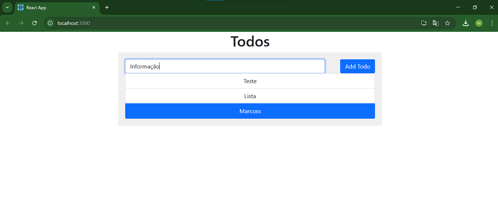

# Construindo uma rede Docker para comunicação entre containers
Crie uma rede Docker personalizada e faça dois containers, um Node.js e um
MongoDB, se comunicarem, sugestão, utilize o projeto React Express + Mongo

## 1. Clonando/criando repositórios
Você pode criar os arquivos para sua aplicação manualmente. Neste caso, estou utilizando os arquivos de um projeto já pronto, disponíveis neste repositório: [React+Mongo+Express](https://github.com/docker/awesome-compose/tree/master/react-express-mongodb).

## 2. Criando arquivo compose
Crie o arquivo compose.yml para fazer a comunicação entre o backend, frontend e banco de dados.
Utilizaremos a porta padrão do MongoDB (27017) para se comunicar com o backend, o frontend (React) usa a porta 3000 para responder às requisições HTTP, e internamente o backend (Express) se comunica com o front através da porta 3000.

## 3. Criação dos containers
Utilizar o seguinte comando para criar os containers e iniciar os serviços definidos no compose.yml
```bash
docker-compose up -d
```

## 4. Verificação
Acesse a aplicação no navegador através do endereço:
http://localhost:3000.

</img>

 Observação: Como estamos utilizando volumes, os dados persistem mesmo após a exclusão e reinicialização dos containers.