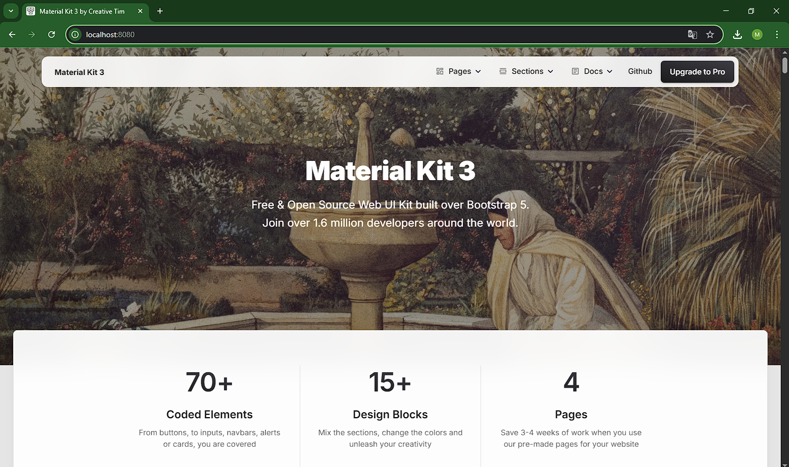

# Criando uma imagem personalizada com um servidor web e arquivos estáticos
Construa uma imagem baseada no Nginx ou Apache, adicionando um site
HTML/CSS estático. Utilize a landing page do Creative Tim para criar uma página
moderna hospedada no container.

## 1. Criando o arquivo index.html
Crie ou Clone um arquivo html para dentro do diretório, os arquivos .css/.js e imagens devem colocados dentro da pasta "assets", estou utilizando os seguintes arquivos [Creative_Tim](https://github.com/creativetimofficial/material-kit)

## 2. Crie o Dockerfile
Crie o arquivo Dockerfile copiando o arquivo index.html e pasta assets para dentro do diretório de serviço do nginx.

## 3. Construa a imagem, rode o container
```bash
docker build -t nginx-page .
docker run -dp 8080:80 nginx-page
```

## 4. Verificação
Confira se sua página está sendo servida corretamente acessando http://localhost.

</img>