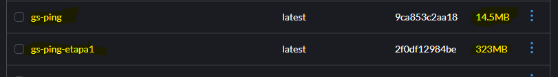

# Criando e rodando um container multi-stage
Utilize um multi-stage build para otimizar uma aplicação Go, reduzindo o tamanho
da imagem final. Utilize para praticar o projeto GS PING desenvolvido em Golang.

## 1. Criando arquivos da aplicação
Crie o arquivo main.go e go.mod.

## 2. Criando o Dockerfile multi-stage
O Dockerfile define como construir a imagem Docker da sua aplicação. Usamos duas etapas (multi-stage) para deixar a imagem final menor.

## 3. Criando imagem e executando container
```bash
docker build -t gs-ping .
docker run -dp 8080:8080 gs-ping
```

## 4. Comparação
Criei uma imagem sem realizar a segunda etapa do Dockerfile, podemos ver a grande diferença no tamanho.

</img>