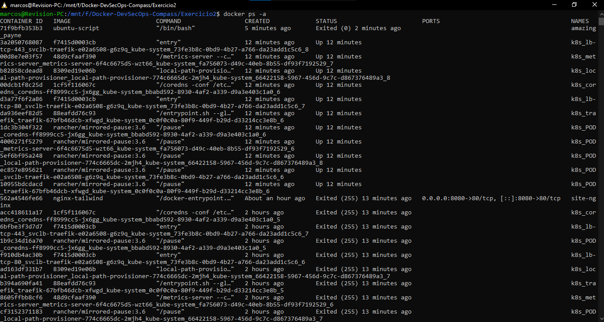
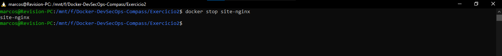

# Listando e removendo containers
Liste todos os containers em execução e parados, pare um container em execução e
remova um container específico.

## 1. Listando os containers
O comando docker ps -a exibe uma lista de todos os containers, incluindo aqueles que estão parados.
```bash
docker ps -a
```
</img>

## 2. Parar um container
Para parar um container em execução, você pode usar o comando docker stop seguido pelo ID ou nome do container.
```bash
docker stop <container_id>
```
</img>

## 3. Removendo um container
Para remover um container específico, primeiro pare o container. Em seguida, use o comando docker rm seguido pelo ID ou nome do container
```bash
docker rm <container_id>
```

Para remover todos os containers parados de uma vez, você pode usar o seguinte comando.
```bash
docker container prune
```
