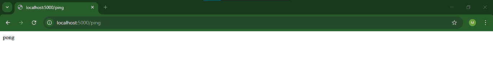
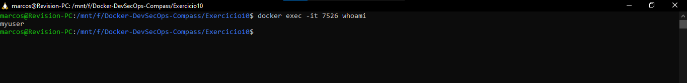

# Evitar execução como root
Ao rodar containers com o usuário root, você expõe seu sistema a riscos maiores em
caso de comprometimento. Neste exercício, você deverá criar um Dockerfile para
uma aplicação simples (como um script Python ou um servidor Node.js) e configurar
a imagem para rodar com um usuário não-root.

## 1. Reutilização de arquivos
Vamos reutilizar os arquivos do exercício 4 e fazer algumas pequenas modificações em seu funcionamento, vamos mesclar com o exercício 6 (ping pong) e alterar para que seja executado por um usuário "não root"
Crie os arquivos:
- app.py
- Dockerfile
- requirements.txt

## 2. Construção de imagem e container
Rode os seguintes comandos para construir a imagem e rodar o container.
```bash
docker build -t flask-app .
docker run -dp 5000:5000 flask-app
```

## 3. Verificação da aplicação e usuario
Acesse http://localhost:5000/ping para verificar se a aplicação está respondendo, em seguida no terminal utilize o seguinte comando para visualizar qual usuário está rodando o container.
```bash
docker exec -it <container_id> whoami
```
obs.: Utilize o comando "docker ps" para identificar o ID do container.

</img>
</img>